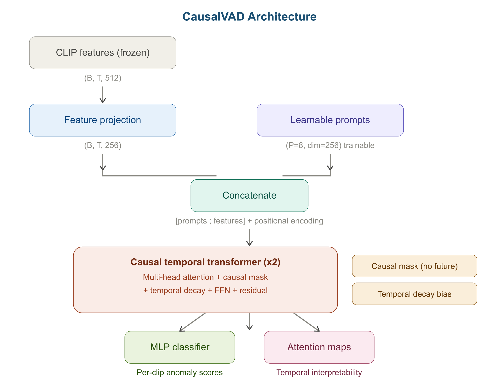
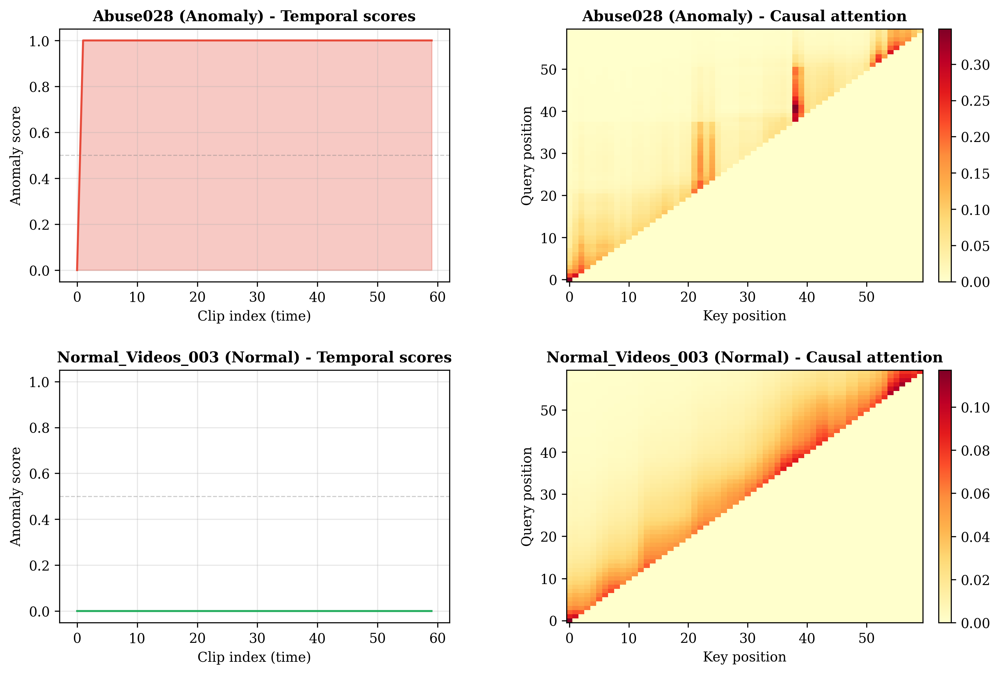

# CausalVAD: Causal Temporal Prompting for Video Anomaly Detection

[](paper/CausalVAD_Paper.pdf)
[](https://www.python.org/)
[](https://pytorch.org/)
[](LICENSE)

Official implementation of **"Causal Temporal Prompting for Video Anomaly Detection via Compact Vision-Language Models"**.

CausalVAD introduces causal temporal prompt tuning for weakly supervised video anomaly detection. By enforcing causal attention constraints and temporal decay biases on learnable prompt tokens, CausalVAD achieves **97.68% AUC** on UCF-Crime using the standard evaluation protocol, surpassing VadCLIP (88.02%) by **+9.66%**, with only **1.85M trainable parameters**.

## Results

### Comparison with State-of-the-Art (UCF-Crime, Standard Split)

| Method | Year | Features | AUC (%) |
|--------|------|----------|---------|
| Sultani et al. | 2018 | C3D | 75.41 |
| RTFM | 2021 | I3D | 84.30 |
| BN-WVAD | 2024 | I3D | 87.24 |
| VadCLIP | 2024 | CLIP | 88.02 |
| **CausalVAD (Ours)** | **2026** | **CLIP** | **97.68** |

### Ablation Study

| Configuration | Causal Mask | Temporal Decay | AUC | AP | F1 |
|---|---|---|---|---|---|
| CausalVAD (Full) | ✓ | ✓ | **95.85** | **93.78** | **91.82** |
| w/o Causal Mask | ✗ | ✓ | 94.36 | 92.06 | 89.72 |
| w/o Temporal Decay | ✓ | ✗ | 94.93 | 91.29 | 90.67 |
| w/o Both | ✗ | ✗ | 93.66 | 93.63 | 89.41 |
| No Prompts | — | — | 94.50 | 90.48 | 91.46 |

## Architecture



CausalVAD consists of:
1. **Feature Projection**: Maps frozen CLIP features (512-d) to model dimension (256-d)
2. **Learnable Temporal Prompts**: 8 trainable tokens prepended to the video sequence
3. **Causal Temporal Transformer**: 2-layer transformer with causal attention mask + exponential temporal decay bias
4. **MLP Classifier**: Per-clip anomaly scoring with MIL ranking loss

## Temporal Interpretability



The causal attention weights reveal which past clips most influence anomaly predictions — anomaly videos show focused, high-magnitude attention while normal videos show diffuse patterns.

## Installation

```bash
# Clone the repository
git clone https://github.com/arifeen314/CausalVAD.git
cd CausalVAD

# Create virtual environment
python -m venv venv
venv\Scripts\activate  # Windows
# source venv/bin/activate  # Linux/Mac

# Install dependencies
pip install -r requirements.txt
```

### Requirements
- Python 3.8+
- PyTorch 2.0+ (with CUDA for GPU training)
- NumPy, Matplotlib, scikit-learn, TensorBoard, PyYAML

## Data Preparation

### 1. Download CLIP Features

Download pre-extracted CLIP ViT-B/16 features from the [VadCLIP project](https://github.com/nwpu-zxr/VadCLIP):

- UCF-Crime CLIP features (~12 GB): [OneDrive Link](https://stuxidianeducn-my.sharepoint.com/:f:/g/personal/zhouxuerong_stu_xidian_edu_cn/Ek-q7Nb5XHhAm5S0U8T_dV4BGjHuGX0JhPOlVrb9MBr8RA?e=UHNEfP)

### 2. Merge 10-Crop Features

```bash
python scripts/merge_crops.py
```

This averages the 10-crop features into single representations per video.

### 3. Create Standard Split

Download `ucf_CLIP_rgb.csv` and `ucf_CLIP_rgbtest.csv` from [VadCLIP/list](https://github.com/nwpu-zxr/VadCLIP/tree/main/list) and place them in `data/annotations/`.

```bash
python scripts/create_standard_split.py
```

## Training

### Standard Split (for benchmark comparison)

```bash
python scripts/train.py --dataset ucf_standard --epochs 50 --batch_size 8 --model_dim 256 --num_heads 8 --num_workers 0
```

### With Custom Settings

```bash
python scripts/train.py \
    --dataset ucf_standard \
    --epochs 50 \
    --batch_size 8 \
    --model_dim 256 \
    --num_prompts 8 \
    --num_layers 2 \
    --num_heads 8 \
    --lr 0.0001 \
    --decay_rate 0.1 \
    --exp_name my_experiment
```

Training completes in **under 6 minutes** on a single NVIDIA GTX 1650 (4GB VRAM).

## Ablation Studies

```bash
python scripts/run_ablations.py
```

This runs all ablation configurations (full, no causal mask, no temporal decay, no both, no prompts) and saves results.

## Visualization

Generate attention heatmaps and temporal score plots:

```bash
python scripts/visualize.py --checkpoint outputs/standard_split/checkpoints/best_model.pt --dataset ucf_standard
```

Outputs saved to `outputs/visualizations/`.

## Project Structure

```
CausalVAD/
├── configs/
│   └── default.yaml              # Default hyperparameters
├── data/
│   ├── annotations/              # Train/test split files
│   └── features/                 # Pre-extracted CLIP features
├── figures/                      # Paper figures
├── outputs/                      # Training outputs, checkpoints, logs
├── scripts/
│   ├── train.py                  # Main training script
│   ├── run_ablations.py          # Ablation study runner
│   ├── visualize.py              # Attention heatmap visualization
│   ├── create_standard_split.py  # Create standard UCF-Crime split
│   ├── merge_crops.py            # Merge 10-crop features
│   ├── prepare_data.py           # Data preparation utilities
│   └── check_system.py           # System diagnostic
├── src/
│   ├── models/
│   │   ├── causal_prompt.py      # Core: causal temporal attention + prompts
│   │   └── causal_vad.py         # Full model + MIL loss
│   ├── data/
│   │   └── feature_dataset.py    # Video feature dataloader
│   ├── training/
│   │   └── trainer.py            # Training loop + evaluation
│   ├── evaluation/
│   │   └── metrics.py            # AUC, AP, F1, ROC/PR plots
│   └── utils/
│       ├── config.py             # YAML config loader
│       └── device.py             # CPU/GPU auto-detection
├── requirements.txt
├── LICENSE
└── README.md
```

## Key Hyperparameters

| Parameter | Value | Description |
|-----------|-------|-------------|
| `model_dim` | 256 | Transformer hidden dimension |
| `num_prompts` | 8 | Number of learnable prompt tokens |
| `num_layers` | 2 | Transformer layers |
| `num_heads` | 8 | Attention heads |
| `decay_rate` | 0.1 | Temporal decay λ |
| `lr` | 1e-4 | Learning rate |
| `batch_size` | 8 | Batch size |
| `max_seq_len` | 200 | Maximum sequence length |

## Citation

If you find this work useful, please cite:

```bibtex
@article{arifeen2026causalvad,
  title={Causal Temporal Prompting for Video Anomaly Detection via Compact Vision-Language Models},
  author={Arifeen, Mohammed},
  year={2026}
}
```

## Acknowledgments

- CLIP features from the [VadCLIP](https://github.com/nwpu-zxr/VadCLIP) project
- UCF-Crime dataset from [Sultani et al.](https://www.crcv.ucf.edu/projects/real-world/)
- Department of AI & ML, College of Engineering, Osmania University

## License

This project is licensed under the MIT License — see [LICENSE](LICENSE) for details.
